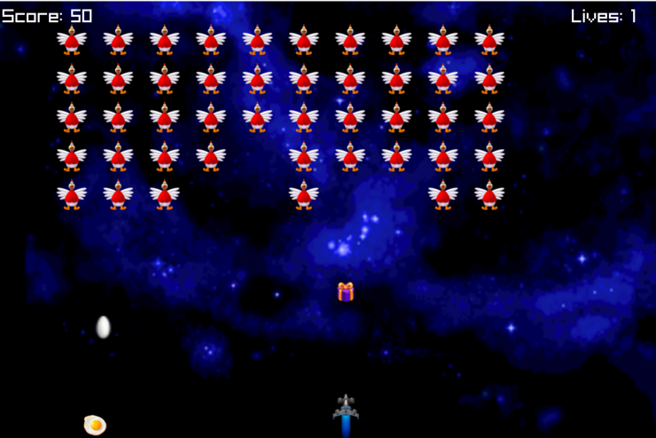
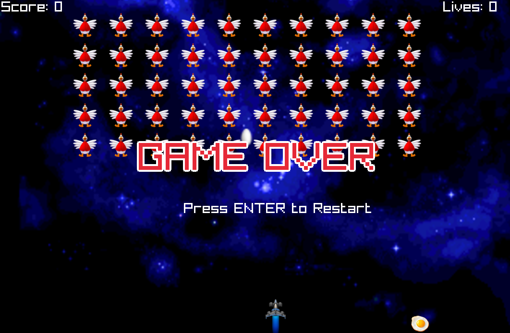

# Space Invaders

A classic arcade-style **Space Invaders** clone built with [raylib](https://www.raylib.com/) (C++). Defend Earth from descending waves of alien invaders — grab power-ups, blast your way to the top score, and see how long you survive.



---

## 🎮 Features

- **5×10 enemy formation** (50 invaders) that marches side to side and descends as it hits the screen edge
- **Player ship** with 3 lives, smooth left/right movement and rapid-fire projectiles
- **Enemy counter-fire** — invaders shoot back, so you have to keep moving
- **Double-shot power-up** — collected by picking up the drop that appears after every 4th kill, granting a twin-shot spread for 7 seconds
- **Bonus notifications** when enemy fire passes the bottom of the screen
- **Closing HUD** showing live **Score** and **Lives**
- **High-stakes game over** — with a shiny outlined "GAME OVER" screen and instant restart
- Built for **60 FPS** at **1080×720**

## 🕹️ Controls

| Key | Action |
|-----|--------|
| `←` / `→` | Move the player ship |
| `Space` | Fire a projectile |
| `Enter` | Restart after game over |

## 📸 Screenshots

> Place the real screenshots of the UI in `docs/screenshots/` using the file names below, and they will appear here automatically. Delete this note once they're added.

| Gameplay | Double-shot power-up | Game over |
|----------|----------------------|-----------|
|  |  |  |

| Game start | During play |
|------------|-------------|
|  |  |

---

## 🚀 Getting Started

### Requirements

- **raylib** — installed at `C:\raylib` (headers in `include/`, libraries in `lib/`)
- **MSYS2 MinGW-w64 toolchain** — `g++` at `C:\msys64\ucrt64\bin\g++.exe`

### Build (one command)

```bat
build.bat
```

This compiles `main.cpp` with raylib and produces `SpaceInvaders.exe` in the project root.

### Run

```bat
SpaceInvaders.exe
```

> The game loads its textures and sounds from the working directory, so run it from the project root.

### Manual build

If you prefer to run the compiler directly:

```bash
g++ main.cpp -o SpaceInvaders.exe \
    -I "C:/raylib/include" \
    -L "C:/raylib/lib" \
    -lraylib -lopengl32 -lgdi32 -lwinmm \
    -static-libgcc -static-libstdc++ \
    -std=c++17 -O2
```

---

## 🎯 How to Play

1. **Survive** — move left/right with the arrow keys and destroy the invaders before they overrun you.
2. **Score** — +10 points per invader destroyed; +50 points for collecting the double-shot power-up.
3. **Power-ups** — every 4th kill drops a **double-shot** pick-up. Catch it to fire twin projectiles for 7 seconds.
4. **Stay alive** — you have **3 lives**. One hit from enemy fire costs a life; reach zero and it's game over.
5. **Victory** — clear all enemies to win. Press `Enter` to restart at any time after a game over.

## 🗂️ Project Structure

```
mygame/
├── main.cpp                # Game source (gameplay, entities, rendering)
├── build.bat               # One-command build script (MinGW + raylib)
├── SpaceInvaders.vcxproj   # Visual Studio project (optional)
├── player_ship.png         # Player ship sprite
├── enemy_invader.png       # Enemy invader sprite
├── enemy_bomb.png          # Enemy projectile sprite
├── powerup_double_shot.png # Double-shot power-up sprite
├── powerup_bonus.png       # Bonus notification sprite
├── background.png          # Background image
├── shoot.wav               # Shooting sound effect
├── game_over.wav           # Game-over sound effect
└── docs/
    └── screenshots/        # UI screenshots (see Screenshots section)
```

## 🛠️ Built With

- [raylib](https://www.raylib.com/) 4.5 — a simple and easy-to-use C/C++ game library
- C++17

## 📄 License

Add your preferred license here (e.g. *MIT License*). See `LICENSE` for details once added.

---

*Enjoy the game — protect the galaxy! 🚀👾*"# Chicken-Invade-clone-using-CPP-and-Raylib" 
